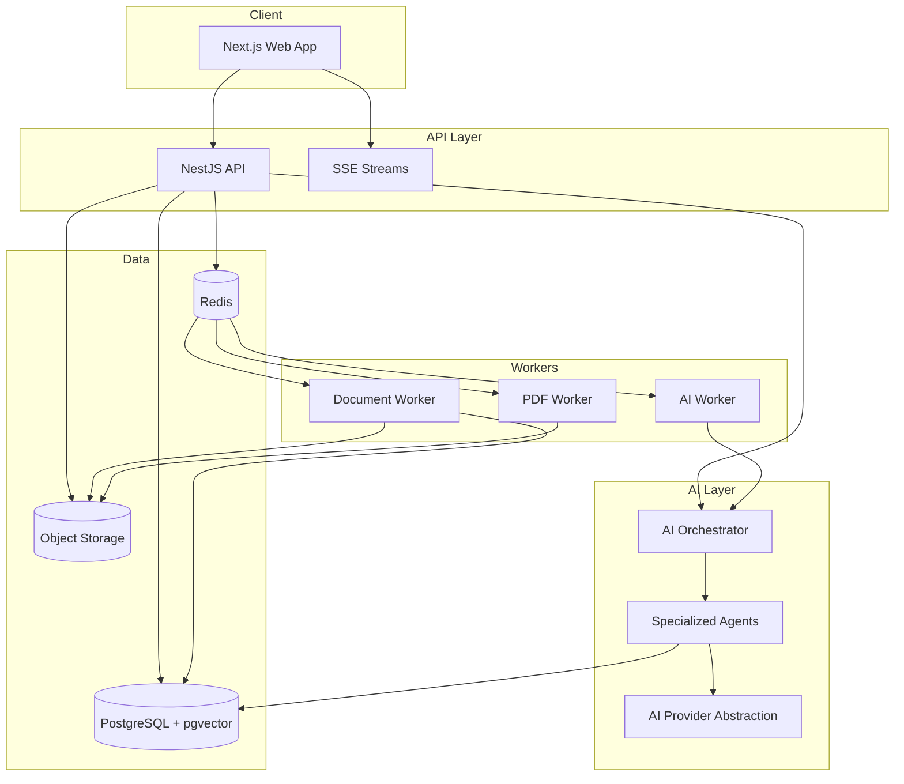

# System architecture

## Executive overview

A **modular monolith API** (NestJS) with **async workers** for documents and AI, a **Next.js** web app, **PostgreSQL** (relational + pgvector), **Redis** (BullMQ), and **object storage** for files and PDFs. AI is accessed through an **orchestrator** that runs specialized agents with **tool-only** data access and **Zod-validated** outputs.

## Service boundaries

| Component | Responsibility |
|-----------|----------------|
| Auth | JWT sessions, org membership, RBAC |
| Projects | State machine, requirements, customers |
| Documents | Upload, scan, parse, chunk, embed |
| AI Orchestrator | Route intents, agent runs, citations |
| Estimation | Line items, formulas, tier rules |
| Pricing | Catalog, sources, confirmation flags |
| Proposals | Sections, versions, approval |
| PDF | HTML template → Chromium → S3 |
| Sharing | Opaque tokens, public read-only view |

## Event / queue jobs

- `document-processing`
- `ocr-processing`
- `embedding-generation`
- `ai-analysis`
- `estimate-generation`
- `proposal-generation`
- `pdf-generation`

API returns `jobId`; clients subscribe via SSE `GET /projects/:id/events`.

## State machine

See `packages/schemas` → `ProjectStatusSchema`. Failures are explicit terminal substates with retry actions from `DRAFT` or last stable state.
